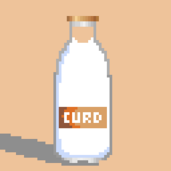

    

<h1 align="center">Curd Arcade</h1>

    

<h2 align="center">Built On</h2>

    
    

## Getting Started

To start the local server:

1. Install [Redis](https://redis.io/docs/getting-started/installation/).
2. Run `yarn` to install the `npm` packages.
3. `yarn dev` to start the local server.

## Contributions and Issues

Feel free to make a [PR](https://github.com/curdinc/curdArcadeDemo/pulls) or [join the discord](https://discord.gg/qTP3czz9pE) to keep up to date when new games go live, payouts happen, or just to leave some feedback!
